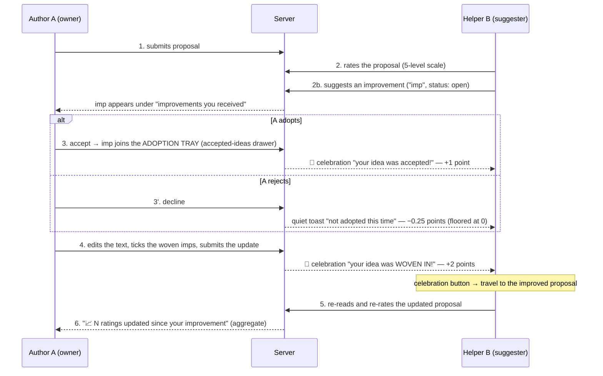

# The Improvement Feedback Cycle — notifications + scores

The deliberation game's core loop is not "write and be judged" — it is
**write → get helped → adopt → improve → be re-judged**. This document
specifies that cycle end-to-end: every state, every notification, every
point, and the surface where each actor sees each event.

Author A owns a proposal. Helper B evaluates it and offers improvements.
The cycle is designed so that *every* handoff between them is announced,
scored, and leads somewhere — no dead ends.

## The cycle



## Suggestion lifecycle (state machine)

```
open ──accept──▶ accepted ──(owner saves an update with the tick)──▶ implemented
  │
  └──decline──▶ declined            (terminal)
```

- `accepted` = a **promise**: the idea sits in the adoption tray
  ("רעיונות שאימצתם" drawer) until the author weaves it into the text.
- `implemented` ("woven in") = the promise **kept**: only an `accepted`
  suggestion can become `implemented`, and only when the author saves an
  actual text update — the tick is local and pending until then, so B's
  "woven in" announcement always arrives together with a real change.
- `thanked` is a legacy path (still used by the chat-flow variant); the
  places UI offers only adopt / decline — two doors, no polite limbo.

## Points (helper B's "helping" score)

| Event                              | Points | Rationale |
|------------------------------------|-------:|-----------|
| Suggestion **accepted**            | **+1** | The promise: your idea was taken |
| Suggestion **woven in** (implemented) | **+2** | The payoff: the text actually changed because of you |
| Suggestion **declined**            | **−0.25** | A light cost — discourages spam, cheap enough to keep risking ideas |
| Suggestion thanked (chat flow only)| +5     | Legacy, unchanged |

Rules:

- Points are awarded **server-side only** (`fn_agoraResolveSuggestion`) —
  the owner resolves, the server validates ownership, so B's score can't
  be spoofed by B.
- A fully successful idea earns **+3 total** (1 on adopt, 2 on weave):
  the reward leans toward *ideas that actually land in text*, not ideas
  that merely get a nod.
- **Floor at 0**: `helping` and `total` never go negative. A student's
  first rejected idea must not open the game with a minus sign.
- The −0.25 penalty is deliberately fractional: four rejections cost one
  acceptance. Watch playtests — if students stop suggesting, drop it to 0
  before dropping the notification (silence is worse than cost).
- Idempotent: re-resolving an already-resolved suggestion is a no-op;
  `implemented` can only fire once per suggestion.

## Notifications

| # | Trigger | Recipient | Form | Content | Leads to |
|---|---------|-----------|------|---------|----------|
| 1 | Suggestion received | A | badge on "שלי" tab + count on the received-accordion | red count | opening the accordion |
| 2 | Accepted | B | 🎉 celebration (glitter) | "your idea was accepted! (+1)" | close — text hasn't changed yet |
| 3 | Declined | B | quiet toast | "not adopted this time (−0.25) — try another angle" | nothing; deliberately low-key |
| 4 | Woven in | B | 🎉 celebration | "your idea is in the text! (+2)" | **primary button → travel to the improved proposal, spotlight it, re-rate** |
| 5 | Helped proposal improved | B | badge on "של אחרים" tab + ✨ marker on the helped card | aggregate | re-reading + re-rating |
| 6 | Ratings moved after my edit | A | 📈 line on the workshop card | "N ratings updated since your improvement" — **aggregate only, never who** | keeping the improvement loop going |

Design rules:

- **Celebrate the wins, whisper the losses.** Accept/woven get glitter;
  decline gets a dismissable toast. Never a modal for bad news.
- **Every good-news notification carries the next move.** The woven-in
  celebration's primary button IS step 5 of the cycle.
- **Aggregates protect anonymity.** A never learns *who* re-rated or
  what any individual changed — only that N ratings moved. Individual
  ratings stay private; the classroom must stay safe.

## Where each actor sees the cycle

| Actor | Surface | What it shows |
|-------|---------|---------------|
| A | Workshop card → received accordion | open imps, two buttons (adopt / no-thanks) |
| A | Adoption tray (accepted-ideas drawer) | every adopted imp + "שילבתי בנוסח" tick |
| A | Workshop card footer | 📈 ratings-moved line (aggregate) |
| B | Celebration popups | accepted (+1), woven (+2 → travel button) |
| B | Toast stack | declined (−0.25), helped-proposal-improved |
| B | "הצעות שעזרתם להן" section (Others side) | current text, ✨ improved marker, re-rate scale, follow-up box |

## Edge cases

- **Self-dealing**: the server rejects resolution by anyone but the
  proposal's author, and awards nothing when suggester == resolver.
- **Accept, then never weave**: the imp stays in the tray; B keeps the
  +1 but never the +2. The tray's visible pendings nudge A.
- **Decline after accept**: impossible — accepted imps leave the
  received list; only `accepted → implemented` remains.
- **B left the session**: points transaction is a no-op if the
  participant doc is gone; notification still writes (harmless).
- **Multiple imps woven in one save**: each resolves separately; B gets
  +2 per imp; the save announces them together.

## Future (deliberately not in this iteration)

- Owner notification "someone raised their rating after your edit" —
  needs server-side rating-delta detection in the rating function, and
  care to keep it aggregate (batch per edit, never per-rater).
- Decay/caps if spam becomes real (max imps per proposal per lap).

---

## AI implementation prompt

A self-contained prompt for building this flow (here or in a similar
evaluate-and-improve product). Hand it to an agent along with repo
access:

> Implement a peer-improvement feedback cycle for a proposal-evaluation
> app with these invariants:
>
> 1. **Actors**: an author owns a text; helpers rate it (5-level scale,
>    one rating per helper, updatable) and submit improvement
>    suggestions.
> 2. **Lifecycle**: suggestion states are `open → accepted →
>    implemented` with a terminal `declined` branch off `open`.
>    `implemented` may only follow `accepted`, and only as a side effect
>    of the author saving a real text update (the "woven" tick is local
>    and pending until that save).
> 3. **Scores**: award points server-side in the resolve endpoint, never
>    client-side: accept = +1, implement = +2, decline = −0.25, floored
>    so no balance goes negative. The resolver must be the author;
>    self-resolution awards nothing. All transitions idempotent.
> 4. **Notifications**: on accept and implement, send the helper a
>    celebratory notification; on decline, a quiet one. The implement
>    notification MUST deep-link to the updated text with a re-rate
>    control (scroll + transient highlight). Good news is loud, bad news
>    is dismissable, and no notification is a dead end — each carries
>    the next action of the loop.
> 5. **Closing the loop**: after the helper re-rates, show the author an
>    aggregate-only signal ("N ratings updated since your edit") —
>    never reveal which helper changed what.
> 6. **Anonymity & safety**: individual ratings are never exposed;
>    penalties are small relative to rewards (≤ ¼ of the accept
>    reward); all copy is warm — rejection reads as "not this time",
>    not failure.
>
> Verify: unit-test the resolve endpoint (each transition, idempotency,
> the floor, the self-dealing guard), and walk the full A→B→A cycle in
> an emulator with two users before calling it done.
