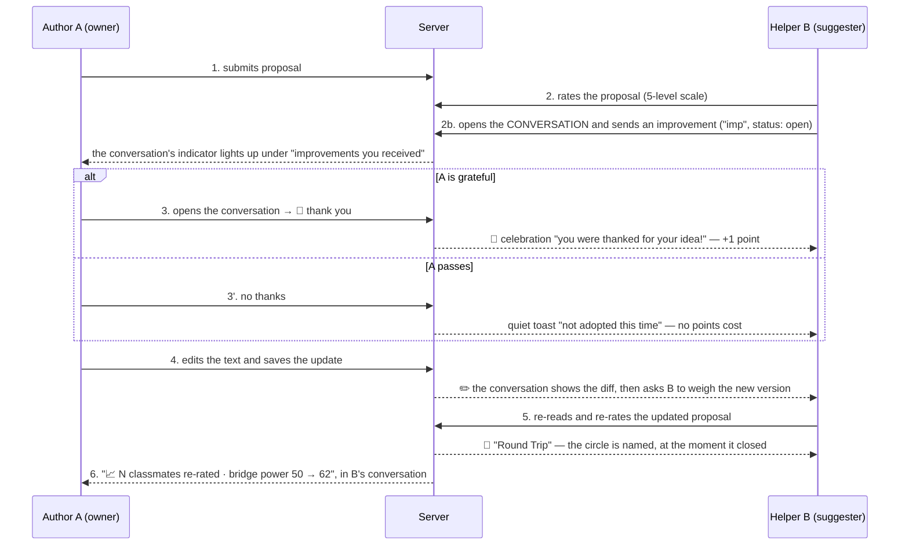

# The Improvement Feedback Cycle — notifications + scores

The deliberation game's core loop is not "write and be judged" — it is
**write → get helped → say thank you → improve → be re-judged**. This document
specifies that cycle end-to-end: every state, every notification, every
point, and the surface where each actor sees each event.

Author A owns a proposal. Helper B evaluates it and offers improvements.
The cycle is designed so that *every* handoff between them is announced,
scored, and leads somewhere — no dead ends.

This file is the **spec**: what the loop does today. For *why* it does it —
the reviews behind each round and, more usefully, what was rejected and on
what grounds — see [`feedback-cycle-improvements.md`](./feedback-cycle-improvements.md).

## The cycle



**What the conversation records.** Two things happen *to* a proposal
rather than being said about it, and both are written into the thread as
system lines — centred, unattributed, quieter than any bubble:

- **✏️ the author changed the text.** Wikipedia's habit: the line shows
  *what* changed, word by word — removed wording struck through, added
  wording highlighted, untouched words plain (`lib/textDiff.ts`, a plain
  word-level LCS; character diffs on Hebrew were unreadable). Written by
  `onAgoraProposalWritten`, the only place holding both versions — and a
  client-written record of "what it used to say" would be one anyone
  could write. It carries **no thread uid**: an edit belongs to every
  conversation about that proposal, not to one helper.
- **🏅 what a thank-you paid.** Written by `agoraResolveSuggestion`
  beside the idea that earned it, so the number can never drift from the
  transaction that produced it. Authored by the *resolver*, so it reads
  as incoming news for the helper and not for the author.

Neither is a message: `isSuggestionKind` is an allow-list
(`undefined || suggestion`), so system lines never occupy an open-idea
slot, never ask the author for a decision, and never fire the "somebody
is talking to you" toast — the edit already has its own toast, and the
award arrives as a celebration.

**What the conversation asks for.** Three more blocks live in the thread,
and none of them is stored: they are recomputed from live state every
render (`lib/improvementSignals.ts`), which is why none can double-fire,
go stale, or need a watermark — and why the whole feature needed no
schema, rules or Cloud Function change.

- **The re-weigh block** (helper side) — shown while the owner has
  revised after my idea and I have not weighed the new version. It clears
  the instant the rating lands, *from any surface*.
- **The credited score line** (owner side) — shown in the ONE thread whose
  helper the owner acknowledged most recently before saving, so a revision
  that followed three thank-yous is not claimed three times.
- **🔁 Round Trip** — the closed circle. Unlike the other two it is
  *history*, so it carries the moment it closed and sorts into the
  conversation by it, rather than sitting under everything that came
  after. Both sides can date it: every student's rating **time** streams
  to everyone (the values never do).

The first two are current state — "what wants you now" — so they stay
pinned at the end where the eye lands.

**Where this happens.** The conversation is a **sub-page**, not a fold
inside a card — the same shape Join gives an option's chat and the main
app gives a statement's chat. A card carries only the indicator every
Freedi surface uses: 💬 bubble, the last thing said, when it was said,
and the unread count. Tapping it takes the whole screen (`ThreadChat`);
the back arrow — or the phone's back gesture — returns to the exact card
you came from. The data is Freedi-standard underneath: every message is a
child `Statement` of the proposal `Statement`, keyed into one
conversation by `agoraThreadUserId` (the helper's uid).

## Suggestion lifecycle (state machine)

```
open ──🙏 thank you──▶ thanked      (terminal, pays the helper)
  │
  └──no thanks──────▶ declined      (terminal, free)
```

- `thanked` is the author's whole positive answer: it pays the helper,
  closes the idea, and counts as the author acknowledging that idea
  (the ✨ "improved with YOUR idea" mark reads it).
- `accepted` and `implemented` are the **retired** accept → weave
  lifecycle (2026-08-09). Nothing writes them any more; every reader
  still understands them so older sessions keep their history intact.
- **One open idea per conversation.** With the mark-as-idea toggle gone,
  the composer decides for itself: while my idea waits on the author the
  box is plain conversation; the moment they answer — thanks or no
  thanks — it offers the next idea. Helping stays earnable every lap, and
  nobody can queue up work nobody asked for.

## Points

Both actors earn. Helper B is paid when the author thanks their idea;
author A is paid for showing up and for actually reaching across the
camps.

### Helper B (the `helping` score)

| Event                              | Points | Rationale |
|------------------------------------|-------:|-----------|
| Suggestion **thanked** (🙏)         | **+1** | The author's whole positive answer, priced at the old accept rung |
| Suggestion **declined**            | **0**  | Free. See "why declining is free" below |
| Suggestion accepted / woven in     | +1 / +2 | **Retired** — the accept → weave chain no longer has a UI. Still paid if an old session resolves one |
| **Re-rating a revision**, and closing a 🔁 Round Trip | **0** | Deliberate, and permanent. Re-rating moves the very number the game is scored on, so a price on it would be a price on the score. The recognition is the reward: the circle gets named, and the invitation is written to recruit a genuine re-read rather than a favour (see "asking for a re-rate without buying it") |

### Author A (the `proposals` score) and everyone (`rating`)

| Event | Points | Rationale |
|-------|-------:|-----------|
| **First proposal submitted** | **+3** | The steepest step of the funnel used to earn nothing at all. Below a landed idea (+3 total) on purpose: showing up must never outpay helping |
| ~~**Weaving a classmate in**~~ | ~~+1 per distinct helper~~ | **Retired with the accept → weave chain.** The constant and the server path survive for old sessions; nothing in the places UI can reach them |
| **Rating a proposal** (anyone) | **+0.5**, first rating only, max 15 credited | Evaluation is the commons the whole game runs on (bridging confidence, rater coverage) and earned nothing. Value-blind, so there is no incentive to rate in any direction |
| **Bridging tier 1** (score ≥ 40) | **+5** | "You reached across." Geometrically unreachable without cross-camp support: own-camp support alone caps the score at 35 |
| **Bridging tier 2** (score ≥ 60) | **+10 more** | The full bridge. Total is still 15 — the old cliff, now a gradient |

Rules:

- Points are awarded **server-side only** — `fn_agoraResolveSuggestion`
  for the ladder, `fn_onAgoraEvaluation` for rating + bridging,
  `fn_onAgoraProposal` for the first-proposal credit. The owner resolves,
  the server validates ownership, so B's score can't be spoofed by B.
- A helpful idea earns **+1**, once per conversation, and only when the
  author says so. It is bounded by construction: one open idea at a time
  per (helper, proposal), and only the author can resolve it.
- **Floor at 0**: `helping` and `total` never go negative.
- Idempotent throughout: re-resolving is a no-op, `implemented` fires
  once per suggestion, the first-proposal credit is guarded by
  `firstProposalAwardedAt`, and each bridging tier pays once
  (`bridgingTierAwarded`, monotonic — a later dip never claws it back).
- **Fractional balances are expected** (+0.5 rating steps, and −0.25
  history). Any surface showing points must render quarters cleanly;
  don't `floor()` for display or students will "lose" visible points.
- Celebration copy takes its number from the **notification's
  `pointsAwarded` field**, never from a hardcoded string — so a retune
  can't make the copy lie, and a weave past the collusion cap honestly
  celebrates with no points attached.

**Why declining is free.** It used to cost −0.25. That penalty was
regressive: the floor at 0 meant a zero-balance spammer paid *nothing*
per decline while the productive helper with points to lose paid full
price — it bound on exactly the students it was never meant to deter.
Spam is now bounded structurally instead: **one open (unresolved)
suggestion per conversation** — the composer simply switches to plain
chat while an idea is waiting, so the rule is felt rather than enforced
with an error. Resolving it frees the slot at once. (The server's
`MAX_OPEN_SUGGESTIONS_PER_HELPER = 2` stays as a backstop.) The quiet
toast stays — silence is worse than cost.

**Asking for a re-rate without buying it.** Telling a helper "they used
your idea — here is the scale" is a pull to be generous, and the number it
pulls on is the class's win condition. Four rules hold the line, and they
are the reason the block looks the way it does:

1. **The claim stays true.** The trigger is an edit that *followed* the
   idea, so the copy says "revised **after** your idea" — never "your idea
   is in the text", which the system cannot know. The diff sits above it;
   the student decides for themselves. An overclaim is falsifiable at a
   glance here, and one false positive teaches a teenager that all of the
   system's praise is noise.
2. **Reading is the path to the control.** The scale does not exist in the
   DOM until "I've read the change" is pressed. No dwell timers — one tap,
   under a lesson countdown.
3. **The scale arrives blank.** The face given last time is *not* marked.
   Showing it, right where another is being asked for, is a consistency
   anchor on the scored number. It is shown afterwards instead, as a
   neutral "before → now".
4. **Same is a real answer**, said out loud every time: "higher, lower or
   the same — an honest rating is what helps the class."

And on the owner's side, the credit is split in two: the **helper** led to
the revision (an act, praiseworthy however it lands), the **class** moved
the number (in both directions). Fusing them into "your score rose because
of X" would denominate a classmate's goodwill in points and hand them the
blame the next time it falls — so on a fall the helper is not named at all.

**Anti-collusion.** A pair trading thank-yous earns +1 per lap at most:
a helper can have only one open idea per conversation, and each idea
needs the author to act before the next one can be sent. The old paid
weave caps (`MAX_WOVEN_AWARDS_PER_HELPER_PER_PROPOSAL`,
`MAX_WEAVE_CREDITS_PER_PROPOSAL`) still guard the retired chain.

**Small classes.** The bridging confidence ramp divides by
`min(MIN_CROSS_RATERS, actual cross-camp students)` instead of a fixed 3.
With two students there is at most one possible cross-camp rater, so the
old fixed denominator capped confidence at 1/3 and the bridging credit
was *arithmetically unreachable*. The denominator never exceeds
`MIN_CROSS_RATERS`, so a full class still has to earn three raters.

## Notifications

| # | Trigger | Recipient | Form | Content | Leads to |
|---|---------|-----------|------|---------|----------|
| 1 | Suggestion received | A | **actionable toast** (peer-orange) + badge on "שלי" tab + count on the received-accordion | "you got an improvement — open the workshop" | tapping the toast stands you in the workshop with the drawer open |
| 2 | Thanked | B | 🎉 celebration (glitter) | "you were thanked for the idea you sent! (+1)" | no button and no hint: a thank-you is the payoff, not a promise of one |
| 3 | Declined | B | quiet toast | "not adopted this time — try another angle" (no number: declining is free) | nothing; deliberately low-key |
| 4 | ~~Woven in~~ | B | 🎉 celebration | **Retired** with the accept → weave chain; still rendered if an old session fires one | primary button → travel to the improved proposal |
| 5 | Helped proposal improved | B | badge on "של אחרים" tab + ✨ marker on the helped card + **the re-weigh block in the conversation** | aggregate | re-reading + re-rating. The marker **clears once B re-rates**, from either surface, and the press is answered with a one-shot "your rating was updated" line |
| 6 | Ratings moved after my edit | A | 📈/📉 chip on the workshop card + **the credited line in the helper's thread** | "N ratings updated · bridge power rose/dropped by M" — count + **direction of the aggregate bridge score**, **never any individual's rating**. Dip renders muted amber, not red. | keeping the improvement loop going |
| 7 | The circle closed | both | 🔁 Round Trip line in the conversation, **at the moment it closed** (the helper's re-rate time, which both sides can read), one celebration for whoever closed it | none (0 points) | sending the next idea — the celebration's hint asks for one |
| 8 | First proposal credited | A | 🎉 celebration | "your proposal is on the square! (+3)" | no button — you are already standing in the workshop |
| 9 | Bridging achieved | A | 🎉 celebration | "your proposal reached across / bridged the camps! (+5 / +10)" — aggregate by construction (a threshold on the score, no rater identity) | **button → back to my proposal** |
| 10 | Class bridge record | everyone | local toast | "✨ new class record — the strongest bridge on the square just grew" | nothing; the one *collective* moment in a game full of personal ones |

Design rules:

- **Celebrate the wins, whisper the losses.** A thank-you gets glitter;
  no-thanks gets a dismissable toast. Never a modal for bad news.
- **Every good-news notification carries the next move** — a button when
  there is somewhere to go, a hint line when there isn't.
- **Aggregates protect anonymity.** A never learns *who* re-rated or
  what any individual changed — only that N ratings moved. Individual
  ratings stay private; the classroom must stay safe.
- **The celebration is a real dialog**: `role="alertdialog"`, focus moved
  onto the primary action, Escape closes. The actionable toast is a real
  `<button>` whose auto-dismiss pauses on hover/focus and runs 12s rather
  than 6. A reward nobody can perceive or reach is a reward not given.
- **"The owner edited" comes from the score doc, and from nothing else.**
  `statement.lastUpdate` is not an edit clock and must never be used as
  one, not even as a fallback. The shared evaluation pipeline writes its
  aggregates back onto the proposal doc, so it moves every time anyone
  rates — and every child write bumps it too, including *the reader's own
  suggestion*, which once made a helper be told the text had changed the
  moment they finished writing to a proposal nobody had touched. The one
  source is `agoraScores.lastEditAt`, stamped server-side only on a real
  text change (and it seeds a whole score doc if none exists, so a genuine
  edit always has one). No stamp therefore means *no known edit*, and
  every dependent signal stays silent — the safe direction, since the
  alternative is announcing a revision that never happened. One accessor,
  `editClock()`, so this can only be got wrong once.

## Where each actor sees the cycle

| Actor | Surface | What it shows |
|-------|---------|---------------|
| A | Workshop card → received accordion | one **indicator per conversation**: 💬, the classmate's name, the last message, its time, the unread count, and how many ideas still want an answer |
| A | The conversation sub-page | the messages themselves; on an open idea, the two doors (🙏 thank you / no thanks) sit under the message they answer, with one line naming what a thank-you does |
| A | Workshop card footer | 📈 ratings-moved line (aggregate), measured against the server-stamped baseline so it survives a refresh |
| B | Celebration popups | thanked (+1) |
| B | Toast stack | declined (free), helped-proposal-improved, class bridge record |
| B | The classmate's card (Others side) | current text, ✨ revised marker (clears once re-rated), re-rate scale + its acknowledgment, and the conversation's indicator — one line in, a whole page out |
| B | The conversation sub-page | the owner's edit as a word-diff, then the **re-weigh block**: a read gate, then a **blank** scale (the previous face is deliberately not shown — it would anchor the very number the game is scored on), then "higher, lower or the same". Says only "revised **after** your idea", never "your idea is in it" — the trigger is an edit that followed, and the diff is the evidence |
| A | The helper's conversation sub-page | the **credited score line**: the helper is named on the *act* that led to the revision, the class owns the *number* in both directions. On a fall the helper is not named at all; at a single re-rater it reports a state, never a delta (one count plus one direction would expose one classmate's vote) |
| both | **Results screen only** | "המסע שלי" — a private recap: total, the helping / rating / proposals / values breakdown, and narrative lines ("N classmates' ideas are in your text"). Framed as *my contribution to the class score*; no ranking, no peer comparison. The ScoreHud stays off the deliberation screens (2026-08-05): during play you hear +1/+2 moments, you never see a balance. |

## Verification

`apps/agora/scripts/e2e-cycle.mjs` walks the whole cycle with a **teacher
and two students** against the emulator and asserts points in Firestore,
not just pixels. Run it with emulators + `npx vite --port 3009` + a seeded
topic package. It covers every row of both tables above:

| Checked | How |
|---|---|
| #1 received | actionable toast reaches A the moment B sends (and is a real `<button>`); accordion count = 1 |
| #2 thanked | B's celebration names +1, is an `alertdialog` with focus moved, and closes on Escape; `helping` 0 → 1 |
| #3 declined | A's quiet toast names **no** number; A's balance is untouched; the card retires and the muted count line appears |
| #5 improved | after A edits, B's card shows the **personal** ✨ re-invitation; it **clears** and the ack line appears once B re-rates |
| #5 in the thread | the conversation carries the same invitation with the diff above it; the scale **does not exist** until "I read the change" is pressed, and arrives with **no previous answer marked** |
| #5 clears anywhere | B rates from the square, and the thread's invitation is gone — the moment is derived from state, never fired as an event |
| #6 ratings moved | A's chip counts 1 (singular copy), names the direction, and **survives a full page reload** |
| #6 in the thread | A's conversation with B reports the class's answer, credited to B by placement |
| #7 round trip | the 🔁 line appears for the pair once the idea → thanks → revision → re-weigh circle closes, dated and sorted into the conversation rather than pinned to the end |
| first proposal | both students' `proposals` = 3 and the credit is announced |
| rating credit | `rating` = 0.5 after the first rating |
| bridging ladder | the credit pays out **in a two-student class** — the case that was arithmetically impossible before |
| sub-page | the card's indicator opens the conversation; the back button returns to it; the composer offers an idea when the desk is clear and plain chat while one is waiting, never blocking conversation |
| personal recap | the on-screen total matches Firestore exactly, quarters intact, with narrative lines |

**Verification status, honestly (2026-08-10).** The round-2 rows were added
with the suite and only partly executed: the two `#5 in the thread` rows and
`#7 round trip` passed live against the emulator; **`#6 in the thread` has
never run** — the emulator degraded mid-session (`agoraCreateSession`
started returning 500) before the corrected owner-inbox path could be
exercised. The round-2 code was also re-worked afterwards (the round trip
became dated and sorted, the score line gained its delta), so the whole
suite wants one clean run against a healthy emulator before it can be
called green.

Unit tests: `packages/shared-types/src/__tests__/agoraBridging.test.ts`
covers the confidence ramp, the small-class pool, and the tier ladder;
`apps/agora/src/lib/__tests__/points.test.ts` covers quarter-exact
rendering (the pill used to oscillate forever on a fractional total).

**Not covered by this script**, and why:

- **Bridging tier 1 in isolation**: the two-student run jumps from 0
  straight to tier 2 (both rungs pay at once, +15). The rung-by-rung
  climb is covered by unit tests, not the walkthrough.
- **The retired weave caps**: `readWeaveLedger` still guards the
  accept → weave chain, which no UI can reach; unit-level logic only.
- **The class bridge-record toast**: fires on a ≥5-point jump in the
  class maximum, which the scripted run reaches only once and racily.
- **The browser/phone back gesture** out of a conversation: the script
  uses the on-screen back arrow. The `popstate` path is the same code.

## Edge cases

- **Self-dealing**: the server rejects resolution by anyone but the
  proposal's author, and awards nothing when suggester == resolver.
- **Thanking twice**: idempotent — the server returns early once a
  suggestion has left `open`, so a double tap pays once.
- **B left the session**: points transaction is a no-op if the
  participant doc is gone; notification still writes (harmless).
- **Chat while an idea is open**: never blocked and never scored — the
  composer says which one it is with its own label.
- **Saving without editing the text**: the save button is armed only by a
  real change, so the ratings-moved baseline can never be re-stamped by
  an empty save.
- **A student who never proposes**: still earns the rating credit, so
  participation is never zero for someone who showed up and evaluated.

## Future (deliberately not in this iteration)

- Owner notification "someone raised their rating after your edit" —
  needs server-side rating-delta detection in the rating function, and
  care to keep it aggregate (batch per edit, never per-rater).
- Decay/caps if spam becomes real (max ideas per proposal per lap).

---

## AI implementation prompt

A self-contained prompt for building this flow (here or in a similar
evaluate-and-improve product). Hand it to an agent along with repo
access:

> Implement a peer-improvement feedback cycle for a proposal-evaluation
> app with these invariants:
>
> 1. **Actors**: an author owns a text; helpers rate it (5-level scale,
>    one rating per helper, updatable) and submit improvement
>    suggestions.
> 2. **Lifecycle**: suggestion states are `open → accepted →
>    implemented` with a terminal `declined` branch off `open`.
>    `implemented` may only follow `accepted`, and only as a side effect
>    of the author saving a real text update (the "woven" tick is local
>    and pending until that save).
> 3. **Scores**: award points server-side in the resolve endpoint, never
>    client-side: accept = +1, implement = +2, decline = 0, floored so no
>    balance goes negative. The resolver must be the author;
>    self-resolution awards nothing. All transitions idempotent. Do NOT
>    make declining cost points: with a floor at zero the penalty is
>    regressive — it is free for the spammer with an empty balance and
>    expensive only for the productive helper. Bound spam structurally
>    instead (a cap on OPEN suggestions per helper per target), and cap
>    paid rewards per (helper, target) pair against collusion. Pay the
>    author too: for their first submission, and per DISTINCT helper they
>    integrate — the distinctness is what makes the mechanic reward
>    breadth of collaboration instead of a two-person trading loop.
> 4. **Notifications**: on accept and implement, send the helper a
>    celebratory notification; on decline, a quiet one. The implement
>    notification MUST deep-link to the updated text with a re-rate
>    control (scroll + transient highlight). Good news is loud, bad news
>    is dismissable, and no notification is a dead end — each carries
>    the next action of the loop.
> 5. **Closing the loop**: after the helper re-rates, show the author an
>    aggregate-only signal ("N ratings updated since your edit") —
>    never reveal which helper changed what. Measure it against a
>    SERVER-stamped record of when the author last edited: any timestamp
>    the rating pipeline itself touches (a lastUpdate bumped by
>    evaluation rollups) will race the signal out of existence, and a
>    client-side snapshot evaporates on refresh.
> 6. **Anonymity & safety**: individual ratings are never exposed;
>    penalties are small relative to rewards (≤ ¼ of the accept
>    reward); all copy is warm — rejection reads as "not this time",
>    not failure.
>
> Verify: unit-test the resolve endpoint (each transition, idempotency,
> the floor, the self-dealing guard), and walk the full A→B→A cycle in
> an emulator with two users before calling it done.

---

## Appendix: image-generation prompt (illustrating the cycle)

For an image AI (DALL-E / Midjourney / Nano Banana). Design constraints
baked in: **no readable text** (models garble it, and our UI is
Hebrew/RTL — icons and numbers stay locale-proof), and **no teal or
purple on characters** (camp colors are reserved in the design system).

**Main prompt:**

> Flat vector infographic illustration of a circular peer-feedback loop
> between two students, for a playful classroom deliberation game. Light
> "festival day" palette: soft sky-blue background (#F4FAFF), warm
> parchment cards (#FFF8EA), golden-yellow accents (#FFD23F). Two
> cartoon teenage students face each other across a circular flow of
> arrows: Student A on the left in royal blue (#2B6FD6) beside a small
> wooden workbench with a glowing blue lantern; Student B on the right
> in warm orange (#E07714) beside a market stand with an orange awning.
>
> The loop runs clockwise through six pictogram stations connected by
> smooth rounded arrows: (1) Student A pins a written proposal card to a
> stand; (2) Student B inspects it with a magnifying glass and rates it
> on a 5-emoji scale, then pins a small yellow sticky note (the
> improvement idea) beneath it; (3) a fork in the arrow — the sticky
> note either flies with golden sparkles into an open wooden drawer
> labeled with a lightbulb (adopted, "+1" gold coin) or gently falls
> aside (declined, a small pale "−¼" chip, no drama); (4) Student A
> weaves the note into the proposal — shown as the note merging into the
> card with a checkbox tick — and raises an updated card ("+2" gold
> coins burst toward Student B with confetti); (5) Student B re-reads
> the improved card and re-rates it, happy expression; (6) a small
> rising line-chart chip with an upward arrow returns to Student A,
> closing the circle.
>
> Golden confetti and sparkles only at the two celebration moments.
> Rounded shapes, soft drop shadows, generous white space, mobile-app
> illustration style, consistent 2px outlines, no gradients heavier than
> subtle. NO readable text anywhere — numbers and icons only (+1, +2,
> −¼ as coin/chip glyphs). Aspect ratio 16:9.

**Negative prompt:** text, letters, words, labels, typography,
photorealism, dark background, red angry symbols, sad crying children,
teal or purple as character colors

**Short variant** (terse-prompt models):

> flat vector infographic, circular feedback loop between two cartoon
> students — blue student with workbench lantern, orange student with
> market stand — six icon stations: proposal card, magnifying glass +
> emoji rating scale, sticky note flying into a drawer with gold +1 coin
> vs falling aside with pale −¼ chip, note weaving into updated card
> with +2 confetti burst, re-rating with happy face, rising chart
> returning to start; festival day palette, sky blue background,
> parchment cards, golden sparkles, rounded 2px outlines, no text, 16:9
