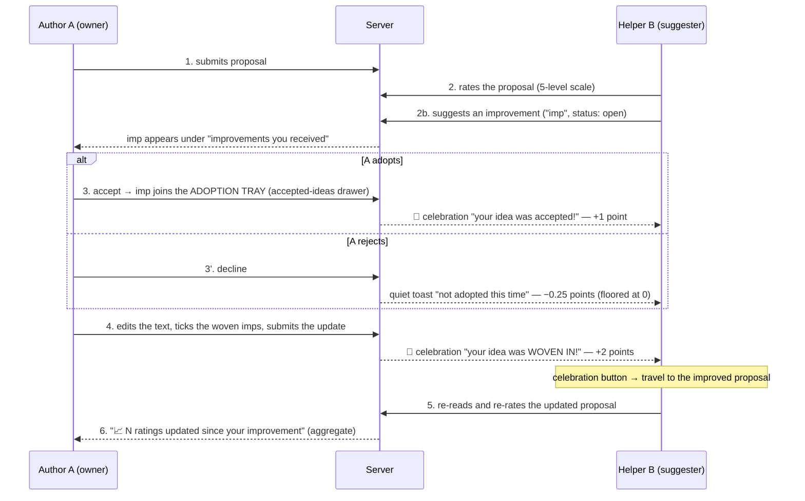

# The Improvement Feedback Cycle — notifications + scores

The deliberation game's core loop is not "write and be judged" — it is
**write → get helped → adopt → improve → be re-judged**. This document
specifies that cycle end-to-end: every state, every notification, every
point, and the surface where each actor sees each event.

Author A owns a proposal. Helper B evaluates it and offers improvements.
The cycle is designed so that *every* handoff between them is announced,
scored, and leads somewhere — no dead ends.

## The cycle



## Suggestion lifecycle (state machine)

```
open ──accept──▶ accepted ──(owner saves an update with the tick)──▶ implemented
  │
  └──decline──▶ declined            (terminal)
```

- `accepted` = a **promise**: the idea sits in the adoption tray
  ("רעיונות שאימצתם" drawer) until the author weaves it into the text.
- `implemented` ("woven in") = the promise **kept**: only an `accepted`
  suggestion can become `implemented`, and only when the author saves an
  actual text update — the tick is local and pending until then, so B's
  "woven in" announcement always arrives together with a real change.
- `thanked` is a legacy path (still used by the chat-flow variant); the
  places UI offers only adopt / decline — two doors, no polite limbo.

## Points (helper B's "helping" score)

| Event                              | Points | Rationale |
|------------------------------------|-------:|-----------|
| Suggestion **accepted**            | **+1** | The promise: your idea was taken |
| Suggestion **woven in** (implemented) | **+2** | The payoff: the text actually changed because of you |
| Suggestion **declined**            | **−0.25** | A light cost — discourages spam, cheap enough to keep risking ideas |
| Suggestion thanked (chat flow only)| +5     | Legacy, unchanged — ⚠️ see warning below |

> ⚠️ **Known inversion on the chat branch**: `thanked` (+5) now outpays a
> fully woven idea (+3). On THIS branch it never fires (the places UI
> has no thanks button), but the chat-flow variant shares these
> constants. Before merging or reviving the chat branch, drop
> `SUGGESTION_THANKED` to ≤ 0.5 or remove the thanks path — a polite
> nod must never earn more than an idea that landed in the text.

Rules:

- Points are awarded **server-side only** (`fn_agoraResolveSuggestion`) —
  the owner resolves, the server validates ownership, so B's score can't
  be spoofed by B.
- A fully successful idea earns **+3 total** (1 on adopt, 2 on weave):
  the reward leans toward *ideas that actually land in text*, not ideas
  that merely get a nod.
- **Floor at 0**: `helping` and `total` never go negative. A student's
  first rejected idea must not open the game with a minus sign.
- The −0.25 penalty is deliberately fractional: four rejections cost one
  acceptance. Watch playtests — if students stop suggesting, drop it to 0
  before dropping the notification (silence is worse than cost).
- Idempotent: re-resolving an already-resolved suggestion is a no-op;
  `implemented` can only fire once per suggestion.
- **Fractional balances are expected** (−0.25 steps → e.g. 2.75). Any
  surface showing points must render quarters cleanly; don't `floor()`
  for display or students will "lose" visible points.

**A's side of the economy** (implicit but load-bearing): adopting costs
A nothing and good adoptions raise A's text quality → ratings → bridging
score → `BRIDGING_BONUS`. That asymmetry is what makes adoption feel
safe. Its known abuse is **collusion** — A and B trading trivial
accept-and-weave rounds for +3 each time. Not worth machinery yet in a
supervised classroom; if it shows up, cap woven awards per helper per
proposal (see Future) before adding any surveillance-flavored fix.

## Notifications

| # | Trigger | Recipient | Form | Content | Leads to |
|---|---------|-----------|------|---------|----------|
| 1 | Suggestion received | A | **actionable toast** (peer-orange) + badge on "שלי" tab + count on the received-accordion | "you got an improvement — open the workshop" | tapping the toast stands you in the workshop with the drawer open |
| 2 | Accepted | B | 🎉 celebration (glitter) | "your idea was accepted! (+1)" | close — text hasn't changed yet |
| 3 | Declined | B | quiet toast | "not adopted this time (−0.25) — try another angle" | nothing; deliberately low-key |
| 4 | Woven in | B | 🎉 celebration | "your idea is in the text! (+2)" | **primary button → travel to the improved proposal, spotlight it, re-rate** |
| 5 | Helped proposal improved | B | badge on "של אחרים" tab + ✨ marker on the helped card | aggregate | re-reading + re-rating |
| 6 | Ratings moved after my edit | A | 📈/📉 chip on the workshop card | "N ratings updated · bridge power rose/dropped by M" — count + **direction of the aggregate bridge score** (vs a client-side snapshot taken at save), **never any individual's rating**. Dip renders muted amber, not red. | keeping the improvement loop going |

Design rules:

- **Celebrate the wins, whisper the losses.** Accept/woven get glitter;
  decline gets a dismissable toast. Never a modal for bad news.
- **Every good-news notification carries the next move.** The woven-in
  celebration's primary button IS step 5 of the cycle.
- **Aggregates protect anonymity.** A never learns *who* re-rated or
  what any individual changed — only that N ratings moved. Individual
  ratings stay private; the classroom must stay safe.

## Where each actor sees the cycle

| Actor | Surface | What it shows |
|-------|---------|---------------|
| A | Workshop card → received accordion | open imps, two buttons (adopt / no-thanks) |
| A | Adoption tray (accepted-ideas drawer) | every adopted imp + "שילבתי בנוסח" tick |
| A | Workshop card footer | 📈 ratings-moved line (aggregate) |
| B | Celebration popups | accepted (+1), woven (+2 → travel button) |
| B | Toast stack | declined (−0.25), helped-proposal-improved |
| B | "הצעות שעזרתם להן" section (Others side) | current text, ✨ improved marker, re-rate scale, follow-up box |
| B | **Results screen only** | running points totals — the ScoreHud was removed from the deliberation screens by design (2026-08-05), so during play B hears +1/+2 moments but sees no balance. Deliberate: the work surface stays score-free. |

## Verification

`apps/agora/scripts/e2e-cycle.mjs` walks the whole cycle with a **teacher
and two students** against the emulator and asserts points in Firestore,
not just pixels. Run it with emulators + `npx vite --port 3009` + a seeded
topic package. It covers every row of both tables above:

| Checked | How |
|---|---|
| #1 received | actionable toast reaches A the moment B sends; accordion count = 1 |
| #2 accepted | B's celebration names +1; `helping` 0 → 1 |
| #3 declined | A's quiet toast; floor holds (0 stays 0) **and** a real balance loses exactly a quarter (1 → 0.75) |
| #4 woven in | B's celebration names +2 (total 3); travel button lands B on the proposal with the spotlight |
| #5 improved | ✨ marker + "שולב בנוסח" chip on B's helped card |
| #6 ratings moved | A's chip counts 1 (singular copy) and names the direction ("bridge power rose by N") |

**Not covered by this script**, and why:

- `BRIDGING_BONUS` (+15 to the author): needs `bridgingScore ≥ 60`, which
  the confidence factor (`MIN_CROSS_RATERS: 3`) puts out of reach with two
  students — a single cross-camp rater caps the score around 22. Needs a
  4+ student run.
- `SUGGESTION_THANKED` (+0.5): the places UI has no thanks button by
  design; only the chat-flow variant can reach it.

⚠️ **`AGORA_POINTS.PROPOSAL_SUBMITTED` (5) is dead** — defined, exported,
and awarded by nothing anywhere in the codebase (the `PROPOSAL_SUBMITTED`
hits in `chatFlow.ts` are an unrelated action-type string). Submitting a
proposal therefore earns zero. Per "A's side of the economy" above, A's
intended motivation is the bridging bonus, so this may simply be a
leftover — but it should either be awarded on first submission or deleted,
not left looking live.

## Edge cases

- **Self-dealing**: the server rejects resolution by anyone but the
  proposal's author, and awards nothing when suggester == resolver.
- **Accept, then never weave**: the imp stays in the tray; B keeps the
  +1 but never the +2. The tray's visible pendings nudge A.
- **Decline after accept**: impossible — accepted imps leave the
  received list; only `accepted → implemented` remains.
- **B left the session**: points transaction is a no-op if the
  participant doc is gone; notification still writes (harmless).
- **Multiple imps woven in one save**: each resolves separately; B gets
  +2 per imp; the save announces them together.

## Future (deliberately not in this iteration)

- Owner notification "someone raised their rating after your edit" —
  needs server-side rating-delta detection in the rating function, and
  care to keep it aggregate (batch per edit, never per-rater).
- Decay/caps if spam becomes real (max imps per proposal per lap; cap
  woven awards per helper per proposal against collusion).
- Fix the thanked inversion before any chat-branch merge (see ⚠️ above).

---

## AI implementation prompt

A self-contained prompt for building this flow (here or in a similar
evaluate-and-improve product). Hand it to an agent along with repo
access:

> Implement a peer-improvement feedback cycle for a proposal-evaluation
> app with these invariants:
>
> 1. **Actors**: an author owns a text; helpers rate it (5-level scale,
>    one rating per helper, updatable) and submit improvement
>    suggestions.
> 2. **Lifecycle**: suggestion states are `open → accepted →
>    implemented` with a terminal `declined` branch off `open`.
>    `implemented` may only follow `accepted`, and only as a side effect
>    of the author saving a real text update (the "woven" tick is local
>    and pending until that save).
> 3. **Scores**: award points server-side in the resolve endpoint, never
>    client-side: accept = +1, implement = +2, decline = −0.25, floored
>    so no balance goes negative. The resolver must be the author;
>    self-resolution awards nothing. All transitions idempotent.
> 4. **Notifications**: on accept and implement, send the helper a
>    celebratory notification; on decline, a quiet one. The implement
>    notification MUST deep-link to the updated text with a re-rate
>    control (scroll + transient highlight). Good news is loud, bad news
>    is dismissable, and no notification is a dead end — each carries
>    the next action of the loop.
> 5. **Closing the loop**: after the helper re-rates, show the author an
>    aggregate-only signal ("N ratings updated since your edit") —
>    never reveal which helper changed what.
> 6. **Anonymity & safety**: individual ratings are never exposed;
>    penalties are small relative to rewards (≤ ¼ of the accept
>    reward); all copy is warm — rejection reads as "not this time",
>    not failure.
>
> Verify: unit-test the resolve endpoint (each transition, idempotency,
> the floor, the self-dealing guard), and walk the full A→B→A cycle in
> an emulator with two users before calling it done.

---

## Appendix: image-generation prompt (illustrating the cycle)

For an image AI (DALL-E / Midjourney / Nano Banana). Design constraints
baked in: **no readable text** (models garble it, and our UI is
Hebrew/RTL — icons and numbers stay locale-proof), and **no teal or
purple on characters** (camp colors are reserved in the design system).

**Main prompt:**

> Flat vector infographic illustration of a circular peer-feedback loop
> between two students, for a playful classroom deliberation game. Light
> "festival day" palette: soft sky-blue background (#F4FAFF), warm
> parchment cards (#FFF8EA), golden-yellow accents (#FFD23F). Two
> cartoon teenage students face each other across a circular flow of
> arrows: Student A on the left in royal blue (#2B6FD6) beside a small
> wooden workbench with a glowing blue lantern; Student B on the right
> in warm orange (#E07714) beside a market stand with an orange awning.
>
> The loop runs clockwise through six pictogram stations connected by
> smooth rounded arrows: (1) Student A pins a written proposal card to a
> stand; (2) Student B inspects it with a magnifying glass and rates it
> on a 5-emoji scale, then pins a small yellow sticky note (the
> improvement idea) beneath it; (3) a fork in the arrow — the sticky
> note either flies with golden sparkles into an open wooden drawer
> labeled with a lightbulb (adopted, "+1" gold coin) or gently falls
> aside (declined, a small pale "−¼" chip, no drama); (4) Student A
> weaves the note into the proposal — shown as the note merging into the
> card with a checkbox tick — and raises an updated card ("+2" gold
> coins burst toward Student B with confetti); (5) Student B re-reads
> the improved card and re-rates it, happy expression; (6) a small
> rising line-chart chip with an upward arrow returns to Student A,
> closing the circle.
>
> Golden confetti and sparkles only at the two celebration moments.
> Rounded shapes, soft drop shadows, generous white space, mobile-app
> illustration style, consistent 2px outlines, no gradients heavier than
> subtle. NO readable text anywhere — numbers and icons only (+1, +2,
> −¼ as coin/chip glyphs). Aspect ratio 16:9.

**Negative prompt:** text, letters, words, labels, typography,
photorealism, dark background, red angry symbols, sad crying children,
teal or purple as character colors

**Short variant** (terse-prompt models):

> flat vector infographic, circular feedback loop between two cartoon
> students — blue student with workbench lantern, orange student with
> market stand — six icon stations: proposal card, magnifying glass +
> emoji rating scale, sticky note flying into a drawer with gold +1 coin
> vs falling aside with pale −¼ chip, note weaving into updated card
> with +2 confetti burst, re-rating with happy face, rising chart
> returning to start; festival day palette, sky blue background,
> parchment cards, golden sparkles, rounded 2px outlines, no text, 16:9
