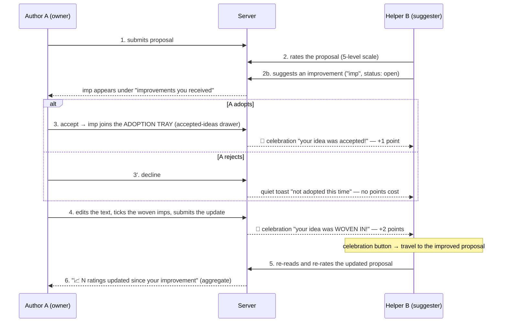

# The Improvement Feedback Cycle — notifications + scores

The deliberation game's core loop is not "write and be judged" — it is
**write → get helped → adopt → improve → be re-judged**. This document
specifies that cycle end-to-end: every state, every notification, every
point, and the surface where each actor sees each event.

Author A owns a proposal. Helper B evaluates it and offers improvements.
The cycle is designed so that *every* handoff between them is announced,
scored, and leads somewhere — no dead ends.

## The cycle



## Suggestion lifecycle (state machine)

```
open ──accept──▶ accepted ──(owner saves an update with the tick)──▶ implemented
  │
  └──decline──▶ declined            (terminal)
```

- `accepted` = a **promise**: the idea sits in the adoption tray
  ("רעיונות שאימצתם" drawer) until the author weaves it into the text.
- `implemented` ("woven in") = the promise **kept**: only an `accepted`
  suggestion can become `implemented`, and only when the author saves an
  actual text update — the tick is local and pending until then, so B's
  "woven in" announcement always arrives together with a real change.
- `thanked` is a legacy path (still used by the chat-flow variant); the
  places UI offers only adopt / decline — two doors, no polite limbo.

## Points

Both actors earn. Helper B climbs the accept → weave ladder; author A is
paid for showing up, for the editorial work of integrating others, and
for actually reaching across the camps.

### Helper B (the `helping` score)

| Event                              | Points | Rationale |
|------------------------------------|-------:|-----------|
| Suggestion **accepted**            | **+1** | The promise: your idea was taken |
| Suggestion **woven in** (implemented) | **+2** | The payoff: the text actually changed because of you |
| Suggestion **declined**            | **0**  | Free. See "why declining is free" below |
| Suggestion thanked (chat flow only)| +0.5   | Legacy; kept below accept (+1) — a polite nod never outpays a landed idea |

### Author A (the `proposals` score) and everyone (`rating`)

| Event | Points | Rationale |
|-------|-------:|-----------|
| **First proposal submitted** | **+3** | The steepest step of the funnel used to earn nothing at all. Below a landed idea (+3 total) on purpose: showing up must never outpay helping |
| **Weaving a classmate in** | **+1 per distinct helper**, max 3/proposal | Integration is real editorial labor. Per-*distinct*-helper, so weaving many voices beats trading rounds with one buddy — the incentive is bridging-shaped by construction |
| **Rating a proposal** (anyone) | **+0.5**, first rating only, max 15 credited | Evaluation is the commons the whole game runs on (bridging confidence, rater coverage) and earned nothing. Value-blind, so there is no incentive to rate in any direction |
| **Bridging tier 1** (score ≥ 40) | **+5** | "You reached across." Geometrically unreachable without cross-camp support: own-camp support alone caps the score at 35 |
| **Bridging tier 2** (score ≥ 60) | **+10 more** | The full bridge. Total is still 15 — the old cliff, now a gradient |

Rules:

- Points are awarded **server-side only** — `fn_agoraResolveSuggestion`
  for the ladder, `fn_onAgoraEvaluation` for rating + bridging,
  `fn_onAgoraProposal` for the first-proposal credit. The owner resolves,
  the server validates ownership, so B's score can't be spoofed by B.
- A fully successful idea earns **+3 total** (1 on adopt, 2 on weave):
  the reward leans toward *ideas that actually land in text*.
- **Floor at 0**: `helping` and `total` never go negative.
- Idempotent throughout: re-resolving is a no-op, `implemented` fires
  once per suggestion, the first-proposal credit is guarded by
  `firstProposalAwardedAt`, and each bridging tier pays once
  (`bridgingTierAwarded`, monotonic — a later dip never claws it back).
- **Fractional balances are expected** (+0.5 rating steps, and −0.25
  history). Any surface showing points must render quarters cleanly;
  don't `floor()` for display or students will "lose" visible points.
- Celebration copy takes its number from the **notification's
  `pointsAwarded` field**, never from a hardcoded string — so a retune
  can't make the copy lie, and a weave past the collusion cap honestly
  celebrates with no points attached.

**Why declining is free.** It used to cost −0.25. That penalty was
regressive: the floor at 0 meant a zero-balance spammer paid *nothing*
per decline while the productive helper with points to lose paid full
price — it bound on exactly the students it was never meant to deter.
Spam is now bounded structurally instead: **max 2 open (unresolved)
suggestions per helper per proposal**, stated in the UI rather than
enforced silently. Resolving any of them frees the slot at once. The
quiet toast stays — silence is worse than cost.

**Anti-collusion.** A and B trading trivial accept-and-weave rounds is
capped at **2 paid woven awards per (helper, proposal)**. Past the cap
the weave still *celebrates* — recognition is decoupled from currency —
but pays nothing. Combined with A's 3-distinct-helper weave cap, a fully
colluding pair is bounded, and the cheapest way to keep earning is to
involve someone new.

**Small classes.** The bridging confidence ramp divides by
`min(MIN_CROSS_RATERS, actual cross-camp students)` instead of a fixed 3.
With two students there is at most one possible cross-camp rater, so the
old fixed denominator capped confidence at 1/3 and the bridging credit
was *arithmetically unreachable*. The denominator never exceeds
`MIN_CROSS_RATERS`, so a full class still has to earn three raters.

## Notifications

| # | Trigger | Recipient | Form | Content | Leads to |
|---|---------|-----------|------|---------|----------|
| 1 | Suggestion received | A | **actionable toast** (peer-orange) + badge on "שלי" tab + count on the received-accordion | "you got an improvement — open the workshop" | tapping the toast stands you in the workshop with the drawer open |
| 2 | Accepted | B | 🎉 celebration (glitter) | "your idea was accepted! (+1)" + **hint**: "when it lands in the text you get +2 and an invitation to re-rate" | no button by design (the text hasn't changed yet) — the hint is what keeps it from being a dead end |
| 3 | Declined | B | quiet toast | "not adopted this time — try another angle" (no number: declining is free) | nothing; deliberately low-key |
| 4 | Woven in | B | 🎉 celebration | "your idea is in the text! (+2)" — or, past the collusion cap, the same celebration with no number | **primary button → travel to the improved proposal, spotlight it, re-rate** |
| 5 | Helped proposal improved | B | badge on "של אחרים" tab + ✨ marker on the helped card | aggregate | re-reading + re-rating. The marker **clears once B re-rates**, and the press is answered with a one-shot "your rating was updated" line |
| 6 | Ratings moved after my edit | A | 📈/📉 chip on the workshop card | "N ratings updated · bridge power rose/dropped by M" — count + **direction of the aggregate bridge score**, **never any individual's rating**. Dip renders muted amber, not red. | keeping the improvement loop going |
| 7 | First proposal credited | A | 🎉 celebration | "your proposal is on the square! (+3)" | no button — you are already standing in the workshop |
| 8 | Bridging achieved | A | 🎉 celebration | "your proposal reached across / bridged the camps! (+5 / +10)" — aggregate by construction (a threshold on the score, no rater identity) | **button → back to my proposal** |
| 9 | Class bridge record | everyone | local toast | "✨ new class record — the strongest bridge on the square just grew" | nothing; the one *collective* moment in a game full of personal ones |

Design rules:

- **Celebrate the wins, whisper the losses.** Accept/woven get glitter;
  decline gets a dismissable toast. Never a modal for bad news.
- **Every good-news notification carries the next move** — a button when
  there is somewhere to go, a hint line when there isn't.
- **Aggregates protect anonymity.** A never learns *who* re-rated or
  what any individual changed — only that N ratings moved. Individual
  ratings stay private; the classroom must stay safe.
- **The celebration is a real dialog**: `role="alertdialog"`, focus moved
  onto the primary action, Escape closes. The actionable toast is a real
  `<button>` whose auto-dismiss pauses on hover/focus and runs 12s rather
  than 6. A reward nobody can perceive or reach is a reward not given.
- **Timestamps come from the score doc, not the statement.** The shared
  evaluation pipeline writes its aggregates back onto the proposal, so
  `statement.lastUpdate` moves every time anyone rates. Both the
  ratings-moved chip and the ✨ marker read `agoraScores.lastEditAt`,
  stamped server-side only on a real text change.

## Where each actor sees the cycle

| Actor | Surface | What it shows |
|-------|---------|---------------|
| A | Workshop card → received accordion | open imps, two buttons (adopt / no-thanks). **Declined imps retire** into one muted "n ideas were not adopted" line — the workshop is a to-do list, not a museum of refusals |
| A | Adoption tray (accepted-ideas drawer) | imps still **waiting** to be woven + the "שילבתי בנוסח" tick. A workbench, not a history — it empties as ideas land in the text. On the **first accept of a session** a one-off coach mark spells out accept → tick → save |
| A | Archive button (📦 "רעיונות ששולבו בנוסח") | every imp that MADE IT into the text, with credit to the classmate who offered it. Appears only once something has been woven; opens on demand |
| A | Workshop card footer | 📈 ratings-moved line (aggregate), measured against the server-stamped baseline so it survives a refresh |
| B | Celebration popups | accepted (+1, with the "+2 next" hint), woven (+2 → travel button) |
| B | Toast stack | declined (free), helped-proposal-improved, class bridge record |
| B | "הצעות שעזרתם להן" section (Others side) | current text, ✨ improved marker (clears once re-rated), re-rate scale + its acknowledgment, follow-up box (disabled at 2 open ideas, with the reason stated) |
| both | **Results screen only** | "המסע שלי" — a private recap: total, the helping / rating / proposals / values breakdown, and narrative lines ("N classmates' ideas are in your text"). Framed as *my contribution to the class score*; no ranking, no peer comparison. The ScoreHud stays off the deliberation screens (2026-08-05): during play you hear +1/+2 moments, you never see a balance. |

## Verification

`apps/agora/scripts/e2e-cycle.mjs` walks the whole cycle with a **teacher
and two students** against the emulator and asserts points in Firestore,
not just pixels. Run it with emulators + `npx vite --port 3009` + a seeded
topic package. It covers every row of both tables above:

| Checked | How |
|---|---|
| #1 received | actionable toast reaches A the moment B sends (and is a real `<button>`); accordion count = 1 |
| #2 accepted | B's celebration names +1, carries the "+2 next" hint, is an `alertdialog` with focus moved, and closes on Escape; `helping` 0 → 1 |
| #3 declined | A's quiet toast names **no** number; A's balance is untouched; the card retires and the muted count line appears |
| #4 woven in | B's celebration names +2 (total 3); travel button lands B on the proposal with the spotlight; **A earns the +1 integration credit** |
| #4 archive | the woven idea leaves A's tray (0 left) and lands in the archive (badge 1), listed with its suggester's name |
| #5 improved | ✨ marker + "שולב בנוסח" chip on B's helped card; the marker **clears** and the ack line appears once B re-rates |
| #6 ratings moved | A's chip counts 1 (singular copy), names the direction, and **survives a full page reload** |
| first proposal | both students' `proposals` = 3 and the credit is announced |
| rating credit | `rating` = 0.5 after the first rating |
| bridging ladder | the credit pays out **in a two-student class** — the case that was arithmetically impossible before |
| open-ideas cap | a third unresolved idea on one proposal is blocked, with the reason shown |
| personal recap | the on-screen total matches Firestore exactly, quarters intact, with narrative lines |

Unit tests: `packages/shared-types/src/__tests__/agoraBridging.test.ts`
covers the confidence ramp, the small-class pool, and the tier ladder;
`apps/agora/src/lib/__tests__/points.test.ts` covers quarter-exact
rendering (the pill used to oscillate forever on a fractional total).

**Not covered by this script**, and why:

- **Bridging tier 1 in isolation**: the two-student run jumps from 0
  straight to tier 2 (both rungs pay at once, +15). The rung-by-rung
  climb is covered by unit tests, not the walkthrough.
- **The collusion cap**: needs a third and fourth weave between the same
  pair. Unit-level logic is in `readWeaveLedger`; a longer run would be
  needed to see it on screen.
- **The class bridge-record toast**: fires on a ≥5-point jump in the
  class maximum, which the scripted run reaches only once and racily.
- `SUGGESTION_THANKED` (+0.5): the places UI has no thanks button by
  design; only the chat-flow variant can reach it.

## Edge cases

- **Self-dealing**: the server rejects resolution by anyone but the
  proposal's author, and awards nothing when suggester == resolver.
- **Accept, then never weave**: the imp stays in the tray; B keeps the
  +1 but never the +2. The tray's visible pendings nudge A.
- **Decline after accept**: impossible — accepted imps leave the
  received list; only `accepted → implemented` remains.
- **B left the session**: points transaction is a no-op if the
  participant doc is gone; notification still writes (harmless).
- **Multiple imps woven in one save**: each resolves separately; B gets
  +2 per imp; the save announces them together.
- **Weaving past the collusion cap**: the third+ woven idea from the same
  helper on the same proposal still fires the celebration, still lands in
  the archive with credit — it just pays 0, and the copy says so by
  omitting the number rather than naming a fake one.
- **Saving without editing the text**: allowed (a tick-only save is how
  pending woven marks go out), but it does **not** re-stamp the
  ratings-moved baseline. Only a real text change does.
- **A student who never proposes**: still earns the rating credit, so
  participation is never zero for someone who showed up and evaluated.

## Future (deliberately not in this iteration)

- Owner notification "someone raised their rating after your edit" —
  needs server-side rating-delta detection in the rating function, and
  care to keep it aggregate (batch per edit, never per-rater).
- Decay/caps if spam becomes real (max imps per proposal per lap; cap
  woven awards per helper per proposal against collusion).

---

## AI implementation prompt

A self-contained prompt for building this flow (here or in a similar
evaluate-and-improve product). Hand it to an agent along with repo
access:

> Implement a peer-improvement feedback cycle for a proposal-evaluation
> app with these invariants:
>
> 1. **Actors**: an author owns a text; helpers rate it (5-level scale,
>    one rating per helper, updatable) and submit improvement
>    suggestions.
> 2. **Lifecycle**: suggestion states are `open → accepted →
>    implemented` with a terminal `declined` branch off `open`.
>    `implemented` may only follow `accepted`, and only as a side effect
>    of the author saving a real text update (the "woven" tick is local
>    and pending until that save).
> 3. **Scores**: award points server-side in the resolve endpoint, never
>    client-side: accept = +1, implement = +2, decline = 0, floored so no
>    balance goes negative. The resolver must be the author;
>    self-resolution awards nothing. All transitions idempotent. Do NOT
>    make declining cost points: with a floor at zero the penalty is
>    regressive — it is free for the spammer with an empty balance and
>    expensive only for the productive helper. Bound spam structurally
>    instead (a cap on OPEN suggestions per helper per target), and cap
>    paid rewards per (helper, target) pair against collusion. Pay the
>    author too: for their first submission, and per DISTINCT helper they
>    integrate — the distinctness is what makes the mechanic reward
>    breadth of collaboration instead of a two-person trading loop.
> 4. **Notifications**: on accept and implement, send the helper a
>    celebratory notification; on decline, a quiet one. The implement
>    notification MUST deep-link to the updated text with a re-rate
>    control (scroll + transient highlight). Good news is loud, bad news
>    is dismissable, and no notification is a dead end — each carries
>    the next action of the loop.
> 5. **Closing the loop**: after the helper re-rates, show the author an
>    aggregate-only signal ("N ratings updated since your edit") —
>    never reveal which helper changed what. Measure it against a
>    SERVER-stamped record of when the author last edited: any timestamp
>    the rating pipeline itself touches (a lastUpdate bumped by
>    evaluation rollups) will race the signal out of existence, and a
>    client-side snapshot evaporates on refresh.
> 6. **Anonymity & safety**: individual ratings are never exposed;
>    penalties are small relative to rewards (≤ ¼ of the accept
>    reward); all copy is warm — rejection reads as "not this time",
>    not failure.
>
> Verify: unit-test the resolve endpoint (each transition, idempotency,
> the floor, the self-dealing guard), and walk the full A→B→A cycle in
> an emulator with two users before calling it done.

---

## Appendix: image-generation prompt (illustrating the cycle)

For an image AI (DALL-E / Midjourney / Nano Banana). Design constraints
baked in: **no readable text** (models garble it, and our UI is
Hebrew/RTL — icons and numbers stay locale-proof), and **no teal or
purple on characters** (camp colors are reserved in the design system).

**Main prompt:**

> Flat vector infographic illustration of a circular peer-feedback loop
> between two students, for a playful classroom deliberation game. Light
> "festival day" palette: soft sky-blue background (#F4FAFF), warm
> parchment cards (#FFF8EA), golden-yellow accents (#FFD23F). Two
> cartoon teenage students face each other across a circular flow of
> arrows: Student A on the left in royal blue (#2B6FD6) beside a small
> wooden workbench with a glowing blue lantern; Student B on the right
> in warm orange (#E07714) beside a market stand with an orange awning.
>
> The loop runs clockwise through six pictogram stations connected by
> smooth rounded arrows: (1) Student A pins a written proposal card to a
> stand; (2) Student B inspects it with a magnifying glass and rates it
> on a 5-emoji scale, then pins a small yellow sticky note (the
> improvement idea) beneath it; (3) a fork in the arrow — the sticky
> note either flies with golden sparkles into an open wooden drawer
> labeled with a lightbulb (adopted, "+1" gold coin) or gently falls
> aside (declined, a small pale "−¼" chip, no drama); (4) Student A
> weaves the note into the proposal — shown as the note merging into the
> card with a checkbox tick — and raises an updated card ("+2" gold
> coins burst toward Student B with confetti); (5) Student B re-reads
> the improved card and re-rates it, happy expression; (6) a small
> rising line-chart chip with an upward arrow returns to Student A,
> closing the circle.
>
> Golden confetti and sparkles only at the two celebration moments.
> Rounded shapes, soft drop shadows, generous white space, mobile-app
> illustration style, consistent 2px outlines, no gradients heavier than
> subtle. NO readable text anywhere — numbers and icons only (+1, +2,
> −¼ as coin/chip glyphs). Aspect ratio 16:9.

**Negative prompt:** text, letters, words, labels, typography,
photorealism, dark background, red angry symbols, sad crying children,
teal or purple as character colors

**Short variant** (terse-prompt models):

> flat vector infographic, circular feedback loop between two cartoon
> students — blue student with workbench lantern, orange student with
> market stand — six icon stations: proposal card, magnifying glass +
> emoji rating scale, sticky note flying into a drawer with gold +1 coin
> vs falling aside with pale −¼ chip, note weaving into updated card
> with +2 confetti burst, re-rating with happy face, rising chart
> returning to start; festival day palette, sky blue background,
> parchment cards, golden sparkles, rounded 2px outlines, no text, 16:9
