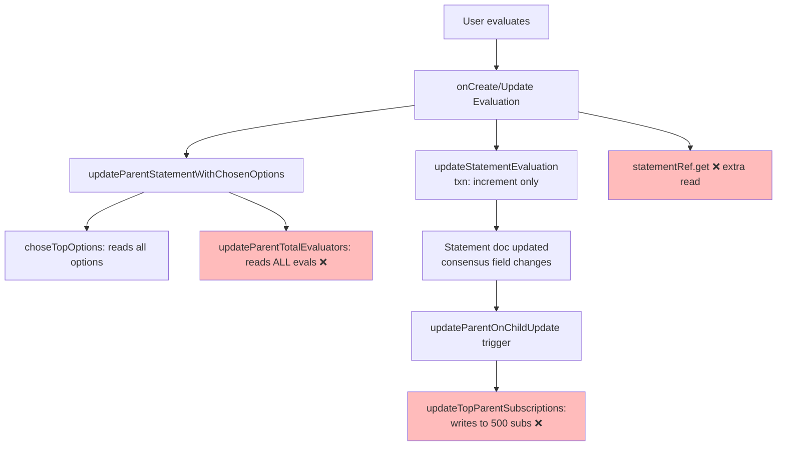

# Plan: Cut Firebase cost drivers for 300–600-participant events

## Context

Two recent events (300 and 600 participants) produced high Firebase bills (₪49.39 over Apr 12–18, split ₪19.70 Gemini / ₪18.42 Firestore / ₪8.94 Functions). The main app fans out aggressively on every user action — a single evaluation triggers trigger chains that read O(evaluators) documents, and client listeners/writes scale quadratically with participant count. The goal is to surgically cut the biggest read/write amplifiers without changing user-visible behavior.

## Observed hot spots (measured from code paths)

For a discussion with **N participants** and **M options**, on every evaluation (N × M events total):

| # | Code location | Problem | Cost per evaluation |
|---|---|---|---|
| 1 | `functions/src/evaluation/updateChosenOptions.ts:103` `updateParentTotalEvaluators` | Reads **every** evaluation under `parentId` via `.where('parentId','==',parentId).get()` to count unique evaluators — just to write one number. | **O(evaluations)** reads (grows to ~N·M per call → **O(N²·M²)** total) |
| 2 | `functions/src/evaluation/updateChosenOptions.ts:65` `updateParentStatementWithChosenOptions` | On every evaluation, re-reads all options under parent, clears `isChosen` with a batch, then re-writes top-N. | O(M) reads + O(M) writes × (N·M) events |
| 3 | `functions/src/evaluation/statementEvaluationUpdater.ts:87` `updatedStatement = await statementRef.get()` | Extra read after transaction just to return data that could be reconstructed from inputs. | 1 extra read per evaluation |
| 4 | `functions/src/fn_statement_updates.ts:58` `updateParentOnChildUpdate` | Triggers on **every** statement update — including the evaluation-driven consensus write. Check at line 98 treats `consensus !== after.consensus` as content change, cascading `updateParentWithLatestChildren` (reads 3 children + writes parent) and often `updateTopParentSubscriptions` (reads + writes **up to 500 subscriptions**). | O(subscriptions) writes per evaluation |
| 5 | `functions/src/fn_subscriptions.ts:478` `updateStatementMemberCount` | On every subscription create/delete, reads **all subscriptions for the statement** to recount — writable as an atomic `FieldValue.increment(±1)`. | O(N) reads per join |
| 6 | `functions/src/engagement/credits/creditEngine.ts:98,105` `isCooldownElapsed` + `getDailyActionCount` | Every evaluation/vote/statement fires `awardCredit`, which makes **2 extra ledger queries** (cooldown + daily-count snapshot) plus a transaction read of `userEngagement`. Daily-count snapshot grows over a session. | 2–3 reads per evaluation/vote |
| 7 | `src/controllers/db/online/setOnline.ts` + `getOnline.ts` | 600 users × listener over `where('statementId','==',id)` → **quadratic** initial payload (~360k doc reads on entry) plus focus/blur writes per tab change. | O(N²) reads + O(focus events) writes |
| 8 | `src/controllers/db/researchLogs/researchLogger.ts:139` | Writes one doc per screen-view / eval / vote (+ LEAVE_SCREEN + VIEW_SCREEN pair) for every user, every route change. At 600 users, this is the second-largest write source after evaluations. | ~1 write per UI action per user |

## Approach (by impact, per event)

### Phase A — Deploy-now fixes (biggest wins, low risk)

**A1. `updateParentTotalEvaluators` — make it incremental.** `functions/src/evaluation/updateChosenOptions.ts:103-159`
Instead of reading every evaluation each time, track membership in a per-parent aggregate doc and flip a counter when a user's *first* non-zero evaluation under that parent arrives (or their last one becomes zero). Two options, prefer (ii):
- (i) Maintain a set-backed doc `evaluatorAggregates/{parentId}` with field `evaluatorIds: string[]` and use `arrayUnion`/`arrayRemove` from the three evaluation triggers; then `totalEvaluators = evaluatorIds.length`.
- (ii) **Preferred:** in each evaluation trigger, do a single targeted read `evaluations where parentId==parentId and evaluatorId==userId limit 1` to see whether this user already counts, then apply `FieldValue.increment(±1)` to the parent's `totalEvaluators`/`evaluation.asParentTotalEvaluators`. 1 read + 1 increment vs. N reads.

**A2. Stop `updateParentOnChildUpdate` from cascading on evaluation-only writes.** `functions/src/fn_statement_updates.ts:88-104`
The current filter removes `lastChildUpdate/lastUpdate/lastSubStatements/description` before comparing JSON. Add `consensus`, `consensusValid`, `evaluation.*`, `proSum`, `conSum`, `totalEvaluators`, `results`, `totalResults`, `chosenOptions`, `isChosen`, `numberOfMembers`, `numberOfOptions`, `subStatementsCount` to the stripped set — these fields are mutated by other triggers and should *not* re-run the "content changed → update parent" cascade. Current `hasContentChange` at line 95 also treats `consensus` change as content change — drop that, it's driven by evaluations, not edits.

**A3. Kill the `updateTopParentSubscriptions` fan-out.** `functions/src/fn_statement_updates.ts:264-343`
Already noted as "REMOVED" in `fn_statementCreation.ts:63` but still called by `updateParentOnChildUpdate` (line 114) and `updateParentOnChildDelete` (line 251). Delete both call sites and the function body; rely on `lastChildUpdate` on the statement doc (client overlay pattern already present per the comments).

**A4. Remove the post-transaction re-read in `updateStatementEvaluation`.** `functions/src/evaluation/statementEvaluationUpdater.ts:87-90`
Change the transaction to return the new statement snapshot inside the `runTransaction` closure (use the doc read already done at line 188 and apply the diffs in memory). Avoids 1 extra read per evaluation.

**A5. Convert `updateStatementMemberCount` to atomic increment.** `functions/src/fn_subscriptions.ts:478-530`
Replace the `where('statementId','==',id).get()` count with `FieldValue.increment(isCreate ? 1 : -1)` on `statements/{id}.numberOfMembers`. Keep the full recount behind a rare admin-only HTTP endpoint for drift repair.

**A6. Online presence — switch to RTDB or drop per-user listener at ≥100 members.** `src/controllers/db/online/`
Firestore is the wrong tool for ephemeral presence. Two options (prefer a):
- (a) **Disable the listener past a threshold**: in `useOnlineUsers.ts`, if `statement.numberOfMembers > 100`, skip `ListenToOnlineUsers` entirely and render only the current user's own chip (or nothing). `OnlineUsers.tsx:34` already hides when list is empty, so UI gracefully degrades. Keeps the feature for small rooms where it's affordable.
- (b) Migrate to Realtime Database's `onDisconnect()` presence pattern. Larger change, defer to Phase B.

**A7. Research logging — sample and gate on event size.** `src/controllers/db/researchLogs/researchLogger.ts`
Currently every screen transition writes 2 docs (LEAVE + VIEW). For events, either (a) batch via `notificationQueue`-style buffering (aggregate N events per user into one doc per minute), or (b) drop `LEAVE_SCREEN`/`VIEW_SCREEN` actions when the parent statement has `statementSettings.enableResearchLogging === true` AND `numberOfMembers > 100` — keep the high-signal actions (EVALUATE, VOTE, CREATE_STATEMENT). Add a `researchSamplingRate` setting (0.0–1.0) read from `statementSettings`; flip a coin per log call.

**A8. Skip credit engine on bulk participant actions.** `functions/src/engagement/credits/trackEngagement.ts`
`trackEvaluationEngagement` runs 2 extra ledger queries + a transaction on every evaluation. For mass-consensus events (`statement.statementSettings.inMassConsensus` or top parent has a `massConsensusProcesses` entry), short-circuit `awardCredit` early based on a feature flag on the statement. `trackEvaluationEngagement` is already wrapped in `.catch`, so it's safe to return early.

**A9. Replace doc-list reads with `count()` aggregation.** Firestore's `.count().get()` bills ~1 read per 1000 docs, not 1 per doc. Use it wherever we only need a number:
- `functions/src/engagement/credits/creditEngine.ts:343-349` `getDailyActionCount` → `.where(...).count().get()` then read `.data().count`. Same for `isCooldownElapsed` at `:323-329`.
- `functions/src/fn_subscriptions.ts:512-518` — when A5's incremental counter drifts, the admin-triggered repair path should use `.count().get()` instead of `.get()`.
- `functions/src/evaluation/updateChosenOptions.ts:106-109` — **not applicable** here because we need *distinct* evaluators, and Firestore has no `countDistinct`; A1's incremental approach still required.
- Audit other `*.size` usages via `Grep "snapshot\.size|\.docs\.length"` in `functions/src/` for additional candidates — at least `fn_subscriptions.ts:148` admin count and `fn_emailNotifications.ts` subscriber counts look swappable.

### Phase B — Structural, follow-up

- **B1.** Replace the in-memory `isEventAlreadyProcessed` dedup (`functions/src/evaluation/evaluationTypes.ts`) with Firestore-backed idempotency — current in-memory set is per-instance and doesn't help warm-start retries on cold instances.
- **B2.** Add `minInstances: 0` and verify `maxInstances` caps on high-frequency triggers (`onStatementCreated`, `newEvaluation`, `updateEvaluation`, `addVote`, `updateStatementMemberCount`) to prevent runaway scale during bursts.
- **B3.** Migrate online presence to RTDB (A6 option b).
- **B4.** Replace the Firestore-per-action research log with a batched client buffer (flush every 30 s, ≤1 doc per user per topParent per flush).
- **B5.** Remove dead Firestore trigger `updateStatementWithViews` (`functions/src/fn_views.ts`) — the `statementViews` collection has no writer in the app per grep, but the function is still deployed and runs a transaction on every doc.

### Phase C — Gemini API cost (₪19.70 — 40% of bill)

Not covered in Phase A/B, but equally significant. Every new statement in MC triggers multiple serial uncached Gemini calls:

- **C1.** **Cache `checkForInappropriateContent` by text hash** — add `moderationCache/{sha256(normalizedText)}` with 30-day TTL. Heavy text duplication in MC (repeated short answers) makes this ~30–60% hit rate. *Edit*: `functions/src/fn_profanityChecker.ts`, new `functions/src/services/moderation-cache.ts`.
- **C2.** **Keyword pre-filter before Gemini** — static bad-word list per language; only call Gemini for ambiguous cases. ~70–90% reduction. *Edit*: `functions/src/fn_profanityChecker.ts`.
- **C3.** **Heuristic `detectStatementType`** — `endsWith('?')` + interrogative word lists cover ~99% of cases across supported languages. *Edit*: `functions/src/fn_detectStatementType.ts`.
- **C4.** **Lower `hybridClusteringSweepScheduled` frequency** from every 15 min to every 60 min, gated on recent evaluation activity.

## Files to modify (Phase A)

- `functions/src/evaluation/updateChosenOptions.ts` (A1, remove O(N) read in `updateParentTotalEvaluators`)
- `functions/src/evaluation/statementEvaluationUpdater.ts` (A4, return statement from transaction)
- `functions/src/evaluation/onCreateEvaluation.ts`, `onUpdateEvaluation.ts`, `onDeleteEvaluation.ts` (A1, pass user-already-counted flag)
- `functions/src/fn_statement_updates.ts` (A2 strip evaluation-derived fields from change detection; A3 delete `updateTopParentSubscriptions` calls + body)
- `functions/src/fn_subscriptions.ts` (A5, atomic increment)
- `src/controllers/hooks/useOnlineUsers.ts` + `src/view/pages/statement/components/nav/online/OnlineUsers.tsx` (A6, threshold gate; read `numberOfMembers` from Redux statement)
- `src/controllers/db/researchLogs/researchLogger.ts` + consumers (A7, sampling + drop screen-view pair for large events)
- `functions/src/engagement/credits/trackEngagement.ts` (A8, short-circuit in mass-consensus mode)
- `functions/src/engagement/credits/creditEngine.ts` (A9, swap `.get()` for `.count().get()` in cooldown and daily-count helpers)

## Files to modify (Phase C)

- `functions/src/fn_profanityChecker.ts` (C1, C2)
- `functions/src/services/moderation-cache.ts` (new, C1)
- `functions/src/fn_detectStatementType.ts` (C3)
- `functions/src/scheduled/*` hybrid clustering sweep (C4)

## Verification

1. **Unit tests** for each changed function (`functions/src/evaluation/__tests__/`, `functions/src/__tests__/`). Key invariants:
   - A1: `totalEvaluators` equals distinct-evaluator count after a 100-user × 10-option synthetic run.
   - A2: Editing a statement body still fires `updateParentWithLatestChildren`; pure evaluation writes do not.
   - A4: Transaction still produces correct `consensus`, `evaluation.*`.
   - A5: `numberOfMembers` after 50 joins + 10 leaves = 40, with no full recount query fired (assert on mock calls).
   - C1: Second call with same text hits cache; third with whitespace variations hits cache.
   - C2: Obvious bad words short-circuit without calling Gemini.
2. **Firebase emulator load test**: `cd functions && npm run test`, then a manual script in `functions/src/__tests__/` that creates 200 users, has each evaluate 20 options, and asserts Firestore read count via emulator stats stays below a budget (target: ≤5 reads per evaluation, down from current ~50+).
3. **Staging deploy to `freedi-test`**: `npm run deploy:f:test`, then run a 20-user mock event and inspect the Cloud Run metrics tab for `newEvaluation` / `updateParentOnChildUpdate` invocation count and billable time. Compare against current baseline.
4. **Client-side (A6, A7)**: `npm run dev`, open a statement as 3 concurrent sessions, verify OnlineUsers still renders ≤100 members and hides ≥100, verify research logs drop screen-views when `numberOfMembers > 100`.
5. **Prod rollout**: after A1-A5 pass staging, `npm run deploy:f:prod`. Watch GCP billing for 24 h; expected read-cost drop ≥ 70 % at event scale.

## Expected impact

For a 600-participant × 20-option event (~12 000 evaluations over 1 hour):

| Fix | Reads saved | Writes saved |
|---|---|---|
| A1 (`updateParentTotalEvaluators`) | ~72 M reads (N×M×N·M/2 eliminated) | — |
| A2 + A3 (stop cascade) | ~6 M reads | ~6 M writes (subscription fan-out) |
| A4 (post-txn read) | 12 000 reads | — |
| A5 (atomic member count) | ~360 k reads (N·N/2) | — |
| A6 (online off at scale) | ~360 k reads, ongoing | ~10 k writes/hr |
| A7 (research sampling) | — | ~100 k writes |
| A8 (credit skip) | ~36 k reads | ~12 k writes |
| A9 (`count()` in credit engine) | ~24 k reads (from ~24 k ledger docs down to ~24 counted reads) | — |
| C1 + C2 (moderation cache + keyword pre-filter) | — | — (saves ~600–900 Gemini calls → ~₪10–15) |
| C3 (heuristic type detection) | — | — (saves ~600 Gemini calls → ~₪1–2) |

Rough order-of-magnitude: **~80 M reads + ~6 M writes + ~1,500 Gemini calls saved per large event** → expect **>80 % cost reduction** at event scale.
